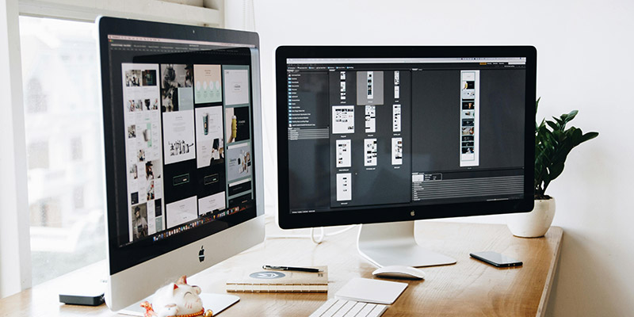

# The Portfolio of Marco De Luca - Front End Web Developer 🚀

Welcome to my personal portfolio repository! This portfolio showcases my work, skills, and projects that reflect my journey as a Front-End Web developer. Here, you’ll find a variety of projects that highlight my abilities including front-end development, responsive design and javascript.

## Table of Contents 📋 
About 
Skills 
Features 
Installation 
Contact 

## About 👨🏻‍💻
This portfolio was created to demonstrate my expertise and growth in various technical and creative areas. Each project provides a hands-on demonstration of different tools, technologies, and problem-solving techniques. I hope this portfolio gives you an insight into my approach to tackling challenges and creating impactful solutions.

## Skills 🥷
Here’s a quick overview of the skills highlighted in this portfolio:

### Languages: 🛠️
JavaScript, HTML5, CSS3
### Frameworks and Libraries: 
Vue.js, GreenSock
### Tools: 
Git, Figma
### Technologies: 
RESTful APIs, Responsive Design, AJAX  

## Features 📋
  ⚡️ Fully Responsive
  ⚡️ Valid HTML5 & CSS3
  ⚡️ GreenSock Animations

## Installation 📦
To run the portfolio locally:

- Clone this repository
- Navigate into the project directory:
- Open the index.html file in your browser, or if using a local server, start the server and navigate to localhost to view.

## Contact 📱
Feel free to reach out if you’d like to collaborate or have any questions!

LinkedIn: [Marco De Luca](https://www.linkedin.com/in/marco-de-luca-71917498/)

Thank you for visiting my portfolio!